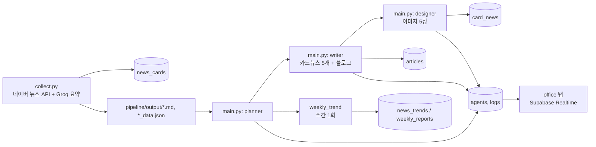
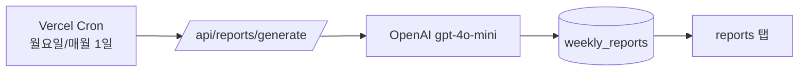

# 데이터 흐름

## 일일 뉴스레터 파이프라인 (매일 06:00 KST)

1. [[pipeline-개요|collect.py]]가 네이버 뉴스 API로 원문을 수집하고 Groq로 요약해 `news_cards`에
   INSERT, 동시에 `pipeline/output/{날짜}.md`와 `_data.json`으로도 저장한다.
2. [[pipeline-개요|main.py]]가 그 출력 파일을 읽어 [[pipeline-agents|planner → writer → designer]]
   순서로 실행, 카드뉴스 5개(`card_news`)와 블로그 아티클(`articles`)을 생성한다.
3. 각 에이전트 실행마다 [[pipeline-agents#supabase_logger|supabase_logger]]가 `agents`/`logs`
   테이블에 상태를 기록 → [[office]] 탭이 Supabase Realtime으로 구독해 실시간 표시.
4. `src/`는 이 테이블들을 Server Component에서 `unstable_cache`로 읽어 [[newsletter]] 탭에 렌더링.

## 리포트 흐름 (pipeline과 독립)

[[reports-generate]]는 pipeline이 아니라 **웹앱 자체의 Vercel Cron**이 트리거한다. `news_cards`,
`news_trends`를 원자료로 읽어 OpenAI로 요약을 생성하고 `weekly_reports`에 upsert한다 — 자세한
내용은 [[reports-generate]] 참고.

## 관련 문서
- [[전체-구조]]
- [[pipeline-개요]]
- [[reports-generate]]
