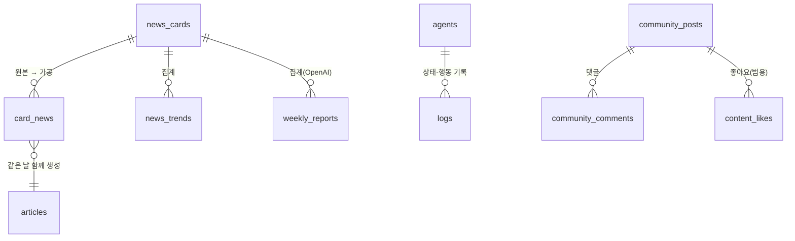

# Supabase 스키마 개요

| 테이블 | 내용 | 쓰는 곳 |
|---|---|---|
| [[news_cards]] | 원본 수집 뉴스 (일일 크롤링) | pipeline `collect.py` |
| [[card_news]] | AI 생성 카드뉴스 (일 5개) | pipeline `main.py` |
| [[articles]] | AI 생성 블로그 아티클 | pipeline `main.py` |
| `news_trends` | 일일 TOP3 트렌드 분석 | pipeline |
| [[weekly_reports]] | 주간·월간 리포트 JSON (`period_type` 판별) | `/api/reports/generate` (OpenAI, service-role) |
| [[agents-logs]] | AI Office 탭 상태 + 활동 로그 (Realtime) | pipeline `supabase_logger.py` |
| [[agent_memories]] | 파이프라인 에이전트 장기 기억 | pipeline |
| [[community-테이블]] | 커뮤니티 게시판 + 좋아요/댓글 | Server Actions |

## 헷갈리기 쉬운 점

`news_cards`(원본 뉴스)와 `card_news`(AI가 생성한 카드뉴스)는 **다른 테이블**이다 —
`CLAUDE.md`에도 명시된 주의 사항. 이름이 비슷해서 코드 리뷰 시 혼동하기 쉬우니 변수명/쿼리에서
항상 어느 테이블인지 명확히 할 것.

## 확인 필요

각 테이블의 실제 컬럼 스키마는 이 볼트 작성 시점에 Supabase 대시보드/마이그레이션 파일로
직접 확인하지 않았다. `mcp__claude_ai_Supabase__list_tables`나 `supabase/migrations/`가 있다면
그걸 보고 각 테이블 노트의 컬럼 표를 채울 것.

## 관련 문서
- [[전체-구조]]
- [[데이터-흐름]]
